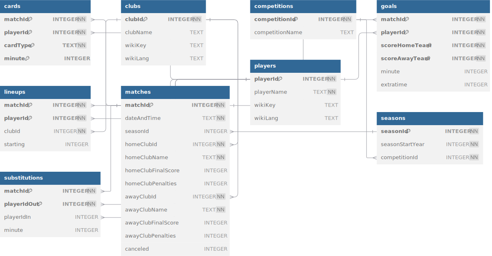

# Feyod: Feyenoord Open Data

## Introduction
This initiative is dedicated to making match data of the Dutch football club Feyenoord accessible to everyone. Feyenoord's rich history deserves to be open to all fans and data enthusiasts.

## Key Features
- **Comprehensive Database**: The core of this project is the `feyod.sql` file, which contains detailed match data of Feyenoord. This database captures player statistics, lineups, substitutions, and more.
- **Accessible Match Data**: By providing this data, we aim to foster an open environment where fans, analysts, and researchers can explore and analyze Feyenoord's match history.

## How to Use
1. Refer to `LICENSE` to understand potential opportunities and limitations for your use case.
1. Clone the repository to your local machine.
2. Import `feyod.sql` into your SQL database management system (SQLite is recommended).
3. Refer to the database diagram below to understand the data relationships and structure.
4. Explore the database!

## Database diagram

## Contribution
Contributions from the community are always welcome! Whether it's adding more data or enhancing documentation, your input is invaluable.